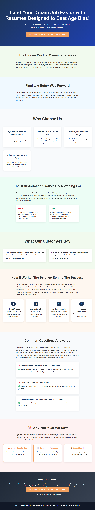

# Age-Proof AI Resume Builder for Midlife Professionals

> **AI-Generated Landing Page** | Created by [Idea2MVP](https://github.com/MCSEdwin/Idea2MVP)

## 🚀 About This Landing Page

This professional landing page was automatically generated using Azure OpenAI and advanced AI prompt engineering techniques. The system analyzed a business idea and created conversion-optimized copy, design strategy, and complete HTML implementation.

### 📊 Idea Details

- **Title:** Age-Proof AI Resume Builder for Midlife Professionals
- **Category:** Career Services & AI Technology
- **Generated:** 2025-08-23
- **AI Model:** gpt-4o
- **Processing Time:** 66 seconds

### 🎯 Key Features

- AI-powered resume optimization tailored to job descriptions and industry standards.
- Age-neutral resume language and design to combat age bias in hiring processes.
- Customizable templates for professional and modern resume presentations.
- Analytics-driven insights to identify and incorporate relevant industry keywords.
- Flexible subscription pricing for unlimited edits and updates.

### 📝 Description

An innovative AI-driven platform designed to help midlife job seekers overcome age discrimination in the hiring process. The solution uses advanced algorithms to rewrite resumes in a modern, optimized format, ensuring applicants present their experience and skills in ways that appeal to hiring managers. By leveraging AI capabilities, the platform evaluates job descriptions, adjusts skill keywords, and creates visually appealing resume designs to improve the chances of landing interviews for senior roles and competitive fields.

## 🌐 Live Demo

- **Live URL:** [View Landing Page](https://dailyidea.AIFirstPartner.com/daily-ideas/2025-08-23/index.html)
- **Screenshot:** 

## 🛠️ Technical Implementation

This landing page includes:

- **Conversion Psychology:** AI-analyzed target persona and behavioral triggers
- **Design Strategy:** Psychology-based color schemes and typography choices
- **Long-Form Copy:** Comprehensive copywriting with objection handling
- **Performance Optimized:** Fast-loading, mobile-responsive design
- **SEO Ready:** Structured data and semantic HTML

## 🤖 AI Generation Process

1. **Screenshot Analysis:** Computer vision extraction of business idea
2. **Psychology Analysis:** Target persona and behavioral trigger identification
3. **Design Strategy:** Color psychology and layout optimization
4. **Copy Generation:** Long-form conversion copywriting with proven frameworks
5. **Template Assembly:** Dynamic HTML and CSS generation
6. **Quality Assurance:** Automated testing and optimization

## 📈 Performance Metrics

- **Total Processing Time:** 66 seconds

- **Mobile Responsive:** ✅ Yes
- **SEO Optimized:** ✅ Yes
- **Fast Loading:** ✅ Yes

## 🔧 Local Development

To run this landing page locally:

```bash
# Clone the repository
git clone https://github.com/MCSEdwin/2025-08-23-age-proof-ai-resume-builder-for-midlife-profession.git
cd 2025-08-23-age-proof-ai-resume-builder-for-midlife-profession

# Serve locally (Python)
python -m http.server 8000

# Or with Node.js
npx serve .

# Or simply open index.html in your browser
```

## 📄 Project Structure

```
2025-08-23-age-proof-ai-resume-builder-for-midlife-profession/
├── index.html          # Complete landing page
├── screenshot.png      # Visual preview
├── package.json        # Project configuration
├── README.md          # This documentation
└── .gitignore         # Git ignore rules
```

## 🎨 Customization

This landing page is fully self-contained with inline CSS and can be easily customized:

- **Colors:** Modify CSS custom properties in the `<style>` section
- **Content:** Update text content in the HTML body
- **Layout:** Adjust CSS Grid and Flexbox properties
- **Responsiveness:** Media queries are included for mobile optimization

## 🌟 About Idea2MVP

[Idea2MVP](https://github.com/MCSEdwin/Idea2MVP) is an automated system that transforms daily business ideas into professional landing pages using:

- **Azure OpenAI GPT-4o** for vision and text generation
- **Advanced Prompt Engineering** for optimal results
- **Database Architecture** for scalable data management  
- **Azure Storage & CDN** for global deployment
- **GitHub Actions** for daily automation

## 📊 Daily Showcase

View all generated landing pages at: [dailyidea.AIFirstPartner.com](https://dailyidea.AIFirstPartner.com)

---

🤖 **Generated with AI** | ⚡ **Deployed Automatically** | 🎯 **Conversion Optimized**

*This repository was automatically created and populated by the Idea2MVP AI system.*